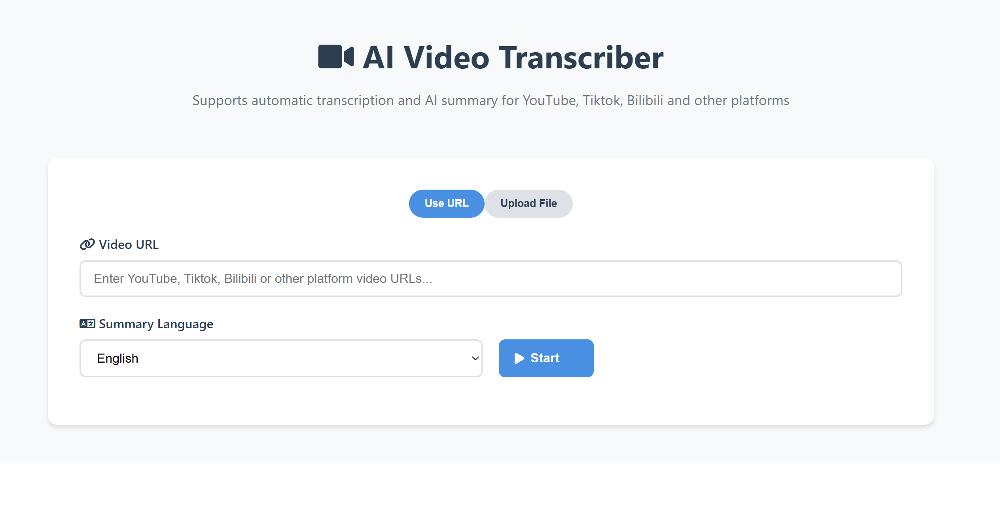

<div align="center">

# AI Video Transcriber

English | [中文](README_ZH.md)

An AI-powered video transcription and summarization tool that supports multiple video platforms including YouTube, Tiktok, Bilibili, and 30+ platforms.



</div>

## ✨ Features

- 🎥 **Multi-Platform Support**: Works with YouTube, Tiktok, Bilibili, and 30+ more
- 🗣️ **Intelligent Transcription**: High-accuracy speech-to-text using Faster-Whisper
- 🤖 **AI Text Optimization**: Automatic typo correction, sentence completion, and intelligent paragraphing
- 🌍 **Multi-Language Summaries**: Generate intelligent summaries in multiple languages
- ⚡ **Real-Time Progress**: Live progress tracking and status updates
- ⚙️ **Conditional Translation**: When the selected summary language differs from the detected transcript language, the system auto-translates with GPT‑4o
- 📱 **Mobile-Friendly**: Perfect support for mobile devices

## 🚀 Quick Start

### Prerequisites

- Python 3.8+
- FFmpeg
- Optional: OpenAI API key (for AI summary features)

### Installation

#### Method 1: Automatic Installation (Recommended)

```bash
# Clone the repository
git clone https://github.com/your-username/AI-Video-Transcriber.git
cd AI-Video-Transcriber

# Run installation script
chmod +x install.sh
./install.sh
```

#### Method 2: Manual Installation

1. **Install Python Dependencies**
```bash
pip install -r requirements.txt
```

2. **Install FFmpeg**
```bash
# macOS
brew install ffmpeg

# Ubuntu/Debian
sudo apt update && sudo apt install ffmpeg

# CentOS/RHEL
sudo yum install ffmpeg
```

3. **Configure Environment Variables** (Optional)
```bash
# Configure OpenAI API key to enable intelligent summaries
export OPENAI_API_KEY=your_api_key_here
```

### Start the Service

```bash
python3 start.py
```

After the service starts, open your browser and visit `http://localhost:8000`

#### Production Mode (Recommended for long videos)

To avoid SSE disconnections during long processing, start in production mode (hot-reload disabled):

```bash
python3 start.py --prod
```

This keeps the SSE connection stable throughout long tasks (30–60+ min).

## 📖 Usage Guide

1. **Enter Video URL**: Paste a video link from YouTube, Bilibili, or other supported platforms
2. **Select Summary Language**: Choose the language for the generated summary
3. **Start Processing**: Click the "Start" button
4. **Monitor Progress**: Watch real-time progress through multiple stages:
   - Video download and parsing
   - Audio transcription with Faster-Whisper
   - AI-powered transcript optimization (typo correction, sentence completion, intelligent paragraphing)
   - AI summary generation in selected language
5. **View Results**: Review the optimized transcript and intelligent summary
   - If transcript language ≠ selected summary language, a third tab “Translation” is shown containing a translated transcript
6. **Download Files**: Click download buttons to save Markdown-formatted files (Transcript / Translation / Summary)

## 🛠️ Technical Architecture

### Backend Stack
- **FastAPI**: Modern Python web framework
- **yt-dlp**: Video downloading and processing
- **Faster-Whisper**: Efficient speech transcription
- **OpenAI API**: Intelligent text summarization

### Frontend Stack
- **HTML5 + CSS3**: Responsive interface design
- **JavaScript (ES6+)**: Modern frontend interactions
- **Marked.js**: Markdown rendering
- **Font Awesome**: Icon library

### Project Structure
```
AI-Video-Transcriber/
├── backend/                 # Backend code
│   ├── main.py             # FastAPI main application
│   ├── video_processor.py  # Video processing module
│   ├── transcriber.py      # Transcription module
│   └── summarizer.py       # Summary module
├── frontend/               # Frontend code
│   ├── index.html          # Main page
│   └── app.js              # Frontend logic
├── temp/                   # Temporary files directory
├── requirements.txt        # Python dependencies
├── start.py               # Startup script
└── README.md              # Project documentation
```

## ⚙️ Configuration Options

### Environment Variables

| Variable | Description | Default | Required |
|----------|-------------|---------|----------|
| `OPENAI_API_KEY` | OpenAI API key | - | No |
| `HOST` | Server address | `0.0.0.0` | No |
| `PORT` | Server port | `8000` | No |
| `WHISPER_MODEL_SIZE` | Whisper model size | `base` | No |

### Whisper Model Size Options

| Model | Parameters | English-only | Multilingual | Speed | Memory Usage |
|-------|------------|--------------|--------------|-------|--------------|
| tiny | 39 M | ✓ | ✓ | Fast | Low |
| base | 74 M | ✓ | ✓ | Medium | Low |
| small | 244 M | ✓ | ✓ | Medium | Medium |
| medium | 769 M | ✓ | ✓ | Slow | Medium |
| large | 1550 M | ✗ | ✓ | Very Slow | High |

## 🔧 FAQ

### Q: Why is transcription slow?
A: Transcription speed depends on video length, Whisper model size, and hardware performance. Try using smaller models (like tiny or base) to improve speed.

### Q: Which video platforms are supported?
A: All platforms supported by yt-dlp, including but not limited to: YouTube, TikTok, Facebook, Instagram, Twitter, Bilibili, Youku, iQiyi, Tencent Video, etc.

### Q: What if the AI optimization features are unavailable?
A: Both transcript optimization and summary generation require an OpenAI API key. Without it, the system provides the raw transcript from Whisper and a simplified summary.

### Q: How to handle long videos?
A: The system can process videos of any length, but processing time will increase accordingly. For very long videos, consider using smaller Whisper models.

## 🎯 Supported Languages

### Transcription
- Supports 100+ languages through Whisper
- Automatic language detection
- High accuracy for major languages

### Summary Generation
- English
- Chinese (Simplified)
- Japanese
- Korean
- Spanish
- French
- German
- Portuguese
- Russian
- Arabic
- And more...

## 📈 Performance Tips

- **Hardware Requirements**:
  - Minimum: 4GB RAM, dual-core CPU
  - Recommended: 8GB RAM, quad-core CPU
  - Ideal: 16GB RAM, multi-core CPU, SSD storage

- **Processing Time Estimates**:
  | Video Length | Estimated Time | Notes |
  |-------------|----------------|-------|
  | 1 minute | 30s-1 minute | Depends on network and hardware |
  | 5 minutes | 2-5 minutes | Recommended for first-time testing |
  | 15 minutes | 5-15 minutes | Suitable for regular use |

## 🤝 Contributing

We welcome Issues and Pull Requests!

1. Fork the project
2. Create a feature branch (`git checkout -b feature/AmazingFeature`)
3. Commit your changes (`git commit -m 'Add some AmazingFeature'`)
4. Push to the branch (`git push origin feature/AmazingFeature`)
5. Open a Pull Request


## Acknowledgments

- [yt-dlp](https://github.com/yt-dlp/yt-dlp) - Powerful video downloading tool
- [Faster-Whisper](https://github.com/guillaumekln/faster-whisper) - Efficient Whisper implementation
- [FastAPI](https://fastapi.tiangolo.com/) - Modern Python web framework
- [OpenAI](https://openai.com/) - Intelligent text processing API

## 📞 Contact

For questions or suggestions, please submit an Issue or contact Wendy.

## ⭐ Star History

If you find this project helpful, please consider giving it a star!