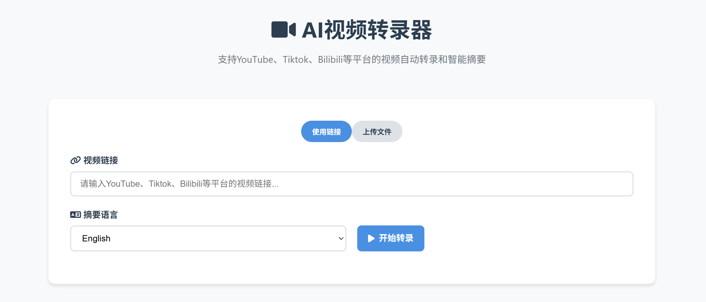

<div align="center">

# AI视频转录器

中文 | [English](README.md)

免费AI视频转录和摘要工具，支持YouTube、Bilibili、抖音等30+平台。



</div>

## ✨ 功能特性

- 🎥 **多平台支持**: 支持YouTube、Bilibili、抖音等30+平台。
- 🗣️ **智能转录**: 使用Faster-Whisper模型进行高精度语音转文字
- 🤖 **AI文本优化**: 自动错别字修正、句子完整化和智能分段
- 🌍 **多语言摘要**: 支持多种语言的智能摘要生成
- ⚙️ **条件式翻译**：当所选总结语言与Whisper检测到的语言不一致时，自动调用GPT‑4o生成翻译
- 📱 **移动适配**: 完美支持移动设备

## 🚀 快速开始

### 环境要求

- Python 3.8+
- FFmpeg
- 可选：OpenAI API密钥（用于智能摘要功能）

### 安装方法

#### 方法一：自动安装（推荐）

```bash
# 克隆项目
git clone https://github.com/your-username/AI-Video-Transcriber.git
cd AI-Video-Transcriber

# 运行安装脚本
chmod +x install.sh
./install.sh
```

#### 方法二：手动安装

1. **安装Python依赖**
```bash
pip install -r requirements.txt
```

2. **安装FFmpeg**
```bash
# macOS
brew install ffmpeg

# Ubuntu/Debian
sudo apt update && sudo apt install ffmpeg

# CentOS/RHEL
sudo yum install ffmpeg
```

3. **配置环境变量**（可选）
```bash
# 配置OpenAI API密钥以启用智能摘要
export OPENAI_API_KEY=your_api_key_here
```

### 启动服务

```bash
python3 start.py
```

服务启动后，打开浏览器访问 `http://localhost:8000`

## 📖 使用指南

1. **输入视频链接**: 在输入框中粘贴YouTube、Bilibili等平台的视频链接
2. **选择摘要语言**: 选择希望生成摘要的语言
3. **开始处理**: 点击"开始"按钮
4. **监控进度**: 观察实时处理进度，包含多个阶段：
   - 视频下载和解析
   - 使用Faster-Whisper进行音频转录
   - AI智能转录优化（错别字修正、句子完整化、智能分段）
   - 生成选定语言的AI摘要
5. **查看结果**: 查看优化后的转录文本和智能摘要
6. **下载文件**: 点击下载按钮保存Markdown格式的文件

## 🛠️ 技术架构

### 后端技术栈
- **FastAPI**: 现代化的Python Web框架
- **yt-dlp**: 视频下载和处理
- **Faster-Whisper**: 高效的语音转录
- **OpenAI API**: 智能文本摘要

### 前端技术栈
- **HTML5 + CSS3**: 响应式界面设计
- **JavaScript (ES6+)**: 现代化的前端交互
- **Marked.js**: Markdown渲染
- **Font Awesome**: 图标库

### 项目结构
```
AI-Video-Transcriber/
├── backend/                 # 后端代码
│   ├── main.py             # FastAPI主应用
│   ├── video_processor.py  # 视频处理模块
│   ├── transcriber.py      # 转录模块
│   └── summarizer.py       # 摘要模块
├── frontend/               # 前端代码
│   ├── index.html          # 主页面
│   └── app.js              # 前端逻辑
├── temp/                   # 临时文件目录
├── requirements.txt        # Python依赖
├── start.py               # 启动脚本
└── README.md              # 项目文档
```

## ⚙️ 配置选项

### 环境变量

| 变量名 | 描述 | 默认值 | 必需 |
|--------|------|--------|------|
| `OPENAI_API_KEY` | OpenAI API密钥 | - | 否 |
| `HOST` | 服务器地址 | `0.0.0.0` | 否 |
| `PORT` | 服务器端口 | `8000` | 否 |
| `WHISPER_MODEL_SIZE` | Whisper模型大小 | `base` | 否 |

### Whisper模型大小选项

| 模型 | 参数量 | 英语专用 | 多语言 | 速度 | 内存占用 |
|------|--------|----------|--------|------|----------|
| tiny | 39 M | ✓ | ✓ | 快 | 低 |
| base | 74 M | ✓ | ✓ | 中 | 低 |
| small | 244 M | ✓ | ✓ | 中 | 中 |
| medium | 769 M | ✓ | ✓ | 慢 | 中 |
| large | 1550 M | ✗ | ✓ | 很慢 | 高 |

## 🔧 常见问题

### Q: 为什么转录速度很慢？
A: 转录速度取决于视频长度、Whisper模型大小和硬件性能。可以尝试使用更小的模型（如tiny或base）来提高速度。

### Q: 支持哪些视频平台？
A: 支持所有yt-dlp支持的平台，包括但不限于：YouTube、抖音、Bilibili、优酷、爱奇艺、腾讯视频等。

### Q: AI优化功能不可用怎么办？
A: 转录优化和摘要生成都需要OpenAI API密钥。如果未配置，系统会提供Whisper的原始转录和简化版摘要。

### Q: 如何处理长视频？
A: 系统可以处理任意长度的视频，但处理时间会相应增加。建议对于超长视频使用较小的Whisper模型。

## 🤝 贡献指南

欢迎提交Issue和Pull Request！

1. Fork项目
2. 创建功能分支 (`git checkout -b feature/AmazingFeature`)
3. 提交更改 (`git commit -m 'Add some AmazingFeature'`)
4. 推送到分支 (`git push origin feature/AmazingFeature`)
5. 开启Pull Request

## 📄 许可证

本项目采用MIT许可证 - 查看 [LICENSE](LICENSE) 文件了解详情。

## 致谢

- [yt-dlp](https://github.com/yt-dlp/yt-dlp) - 强大的视频下载工具
- [Faster-Whisper](https://github.com/guillaumekln/faster-whisper) - 高效的Whisper实现
- [FastAPI](https://fastapi.tiangolo.com/) - 现代化的Python Web框架
- [OpenAI](https://openai.com/) - 智能文本处理API

## 📞 联系方式

如有问题或建议，请提交Issue或联系Wendy。
